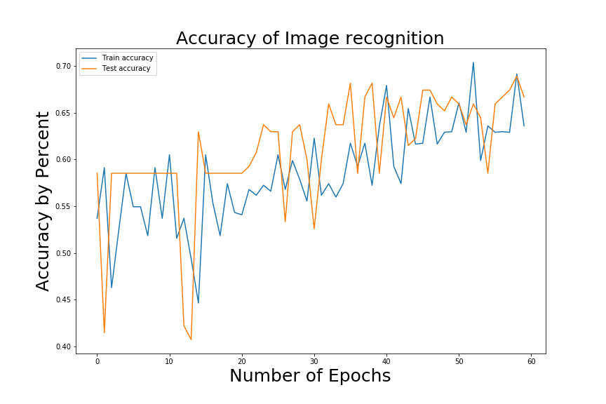
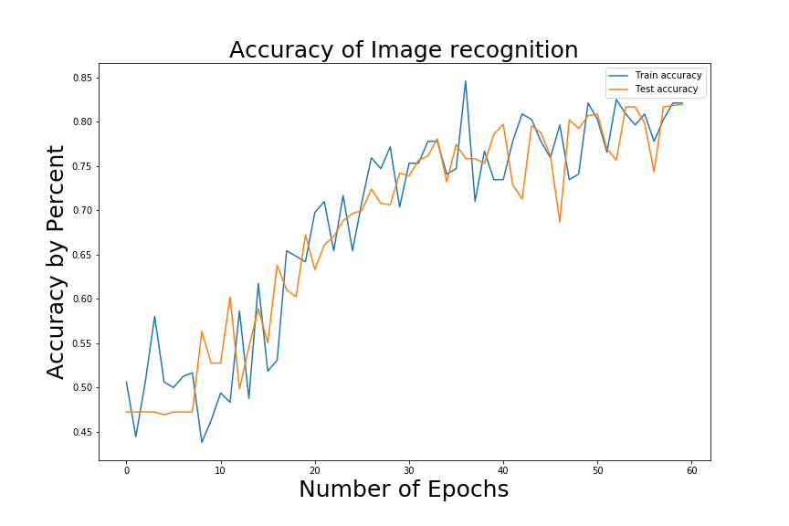

# Problem Statement
There are over 10,000 known species of mushrooms across the world; the goal of this project is to train neural networks to classify mushrooms based on their various features.

# Obtain the data
This portion of the project proved to be the most essential in properly training a model. I started out with the grand idea of providing an image of a mushroom to a model and having the program tell me the exact species of the mushroom.

#### Construct Convolutional Neural Networks

1. Convert image data to numeric arrays based off of color data stored in a file
    - Construct a Sequential Neural Network  
2. Multiple Convolutional Layers
    - Flattened into an Array 
    - Feed into a Dense Neural Network  
3. Compile the layers  
4. Fit the model with Training Data 

---

#### Train a neural network to identify species:

 

[Mushroom World](https://www.mushroom.world/) 
had a fantastic alphabetical list of mushrooms by species with measurements for the mushroom as well as indicators on if the species was edible. Through the use of the webscraper I obtained 137 different species of mushrooms and anywhere between 4-7 images for each mushroom!

After exploring the obtained images in more detail and running some models; I quickly concluded that the network would need far more than a fist full of mushrooms in order to make accurate predictions on species. Trying to identify 137 different classes on 5 images per class wasn't going to cut it no matter how many ways the pictures were turned or zoomed.

---

#### Since attempting to identify species wasn't working out:
I proceed to use this data from the webscraper in order to divide the data into two classes. 
> 0 - Edible 
1- Inedible

Figuring that since I had 273 images of edible species and 347 images of inedible species already in a folder and saved into a database I can quickly build models with slight adjustments to the original codes. These tests had a sudden impact and training the models yielded much better results! 

### 
Summary Results

|                 | Predicted Edible | Predicted Poison |
|-----------------|------------------|------------------|
| Actually Edible | 30               | 26               |
| Actual Poison   | 27               | 52               |

66% Accurate predictions

20% False Negatives

60% ROC AUC on trained model

VS 50% ROC AUC score on baseline

---

#### Putting our mushrooms where the money is at:
Since using more data on two classes was giving more accurate results I decided to go for gold and separate the good morels from the bad. 
[Chrome image downloader](https://chrome.google.com/webstore/detail/image-downloader/cnpniohnfphhjihaiiggeabnkjhpaldj?hl=en-US)
was a very useful tool in quickly obtaining a large batch of images from [Bing](http://www.bing.com) of the three morels :
> Morchella elata   (Black Morel) - The Good - Edible 
Gyromitra esculenta   (False Morel) - The Bad - Lethally Poisonous  
Gyromitra infula   (Hooded false morel) - The Ugly - Poisonous

These three species were put into two groups to be tested on the neural network
- True Morels
    - Morchella elata   (Black Morel)   
- Bad Morels
    - Gyromitra esculenta   (False Morel) 
    - Gyromitra infula   (Hooded false morel) 

### 
Summary Results

|                    | Predicted True Morel | Predicted False Morel |   |   |
|--------------------|----------------------|-----------------------|---|---|
| Actual True Morel  | 260                  | 31                    |   |   |
| Actual False Morel | 65                   | 260                   |   |   |

80% Accurate predictions

10% False Negatives

85% ROC AUC on trained model

VS 50% ROC AUC score on baseline

___

# 
Conclusion

Any which way you can get a larger amount of relevant data is going to be greatly beneficial in using neural networks to classify features of mushrooms. The accuracy result increases going from 5 images per class, to 300 per class, to 1000 per class shows how much having enough of the proper data is probably the most important aspect of making accurate predictions on future data.
